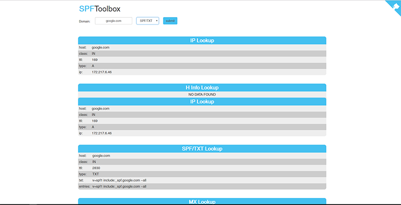

<!--
N.B.: This README was automatically generated by https://github.com/YunoHost/apps/tree/master/tools/README-generator
It shall NOT be edited by hand.
-->

# SPFtoolbox for YunoHost

[](https://dash.yunohost.org/appci/app/spftoolbox)    
[](https://install-app.yunohost.org/?app=spftoolbox)

*[Lire ce readme en français.](./README_fr.md)*

> *This package allows you to install SPFtoolbox quickly and simply on a YunoHost server.
If you don't have YunoHost, please consult [the guide](https://yunohost.org/#/install) to learn how to install it.*

## Overview

Application app to look up DNS records such as SPF, MX, Whois, and more

**Shipped version:** 2.1.1~ynh1

**Demo:** http://spftoolbox.com/

## Screenshots



## Documentation and resources

* Official app website: http://spftoolbox.com/
* Upstream app code repository: https://github.com/charlesabarnes/SPFtoolbox
* YunoHost documentation for this app: https://yunohost.org/app_spftoolbox
* Report a bug: https://github.com/YunoHost-Apps/spftoolbox_ynh/issues

## Developer info

Please send your pull request to the [testing branch](https://github.com/YunoHost-Apps/spftoolbox_ynh/tree/testing).

To try the testing branch, please proceed like that.
```
sudo yunohost app install https://github.com/YunoHost-Apps/spftoolbox_ynh/tree/testing --debug
or
sudo yunohost app upgrade spftoolbox -u https://github.com/YunoHost-Apps/spftoolbox_ynh/tree/testing --debug
```

**More info regarding app packaging:** https://yunohost.org/packaging_apps