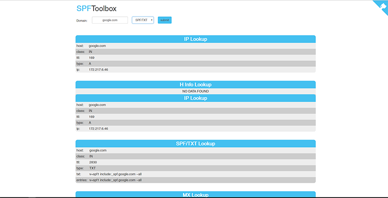

<!--
Важно: этот README был автоматически сгенерирован <https://github.com/YunoHost/apps/tree/master/tools/readme_generator>
Он НЕ ДОЛЖЕН редактироваться вручную.
-->

# SPFtoolbox для YunoHost

[](https://ci-apps.yunohost.org/ci/apps/spftoolbox/)


[](https://install-app.yunohost.org/?app=spftoolbox)

*[Прочтите этот README на других языках.](./ALL_README.md)*

> *Этот пакет позволяет Вам установить SPFtoolbox быстро и просто на YunoHost-сервер.*  
> *Если у Вас нет YunoHost, пожалуйста, посмотрите [инструкцию](https://yunohost.org/install), чтобы узнать, как установить его.*

## Обзор

SPF Toolbox was created to be an easy, free open source way for people to get information about their domain.


**Поставляемая версия:** 2023.11.17~ynh1

**Демо-версия:** <http://spftoolbox.com/>

## Снимки экрана



## Документация и ресурсы

- Официальный веб-сайт приложения: <http://spftoolbox.com/>
- Репозиторий кода главной ветки приложения: <https://github.com/charlesabarnes/SPFtoolbox>
- Магазин YunoHost: <https://apps.yunohost.org/app/spftoolbox>
- Сообщите об ошибке: <https://github.com/YunoHost-Apps/spftoolbox_ynh/issues>

## Информация для разработчиков

Пришлите Ваш запрос на слияние в [ветку `testing`](https://github.com/YunoHost-Apps/spftoolbox_ynh/tree/testing).

Чтобы попробовать ветку `testing`, пожалуйста, сделайте что-то вроде этого:

```bash
sudo yunohost app install https://github.com/YunoHost-Apps/spftoolbox_ynh/tree/testing --debug
или
sudo yunohost app upgrade spftoolbox -u https://github.com/YunoHost-Apps/spftoolbox_ynh/tree/testing --debug
```

**Больше информации о пакетировании приложений:** <https://yunohost.org/packaging_apps>
